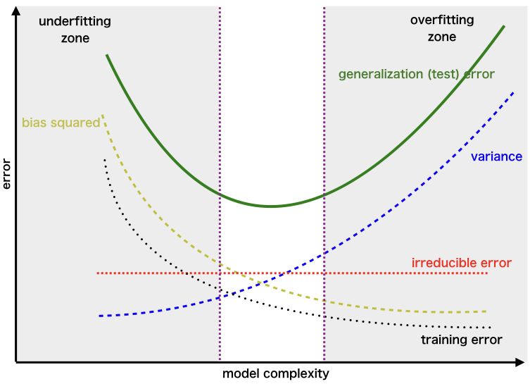
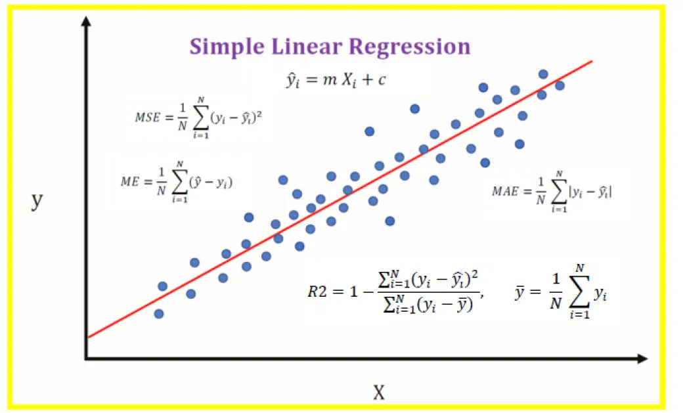

# Linear Regression : The Foundation of Machine Learning

Linear regression is often considered the starting point for anyone beginning their machine learning journey. At first glance, it seems simple — and in many ways, it is. However, there are several constraints and assumptions behind the model that people often overlook when building it. Understanding these boundaries is essential to ensure the model’s reliability.

At its core, linear regression is about fitting a straight line to data. If the dataset contains only a single feature, the technique is called Simple Linear Regression. When multiple features are involved, it becomes Multiple Linear Regression.

### Assumptions of Linear Regression

For linear regression to give reliable results, certain assumptions must hold true:

- Linearity
  - There should be a linear relationship between the independent variable(s) and the dependent variable.
- Independence of Errors
  - The residuals (errors) should be independent of each other. In other words, one error should not influence another.
- Normality of Errors
  - The residuals should be normally distributed. This helps in making valid inferences about the coefficients.
- Homoscedasticity
  - The residuals should have constant variance across all levels of the independent variables. If variance changes (heteroscedasticity), predictions may become unreliable.
- No Multicollinearity
  - Independent variables should not be highly correlated with each other. Strong correlation among predictors makes it difficult to estimate the effect of each variable accurately.
- No Autocorrelation
  - Errors should not be correlated with themselves over time. Autocorrelation is common in time-series data and violates regression assumptions.
- Feature Relevance (practical consideration)
  - The chosen features should have meaningful predictive power. Irrelevant or noisy features can reduce model performance.

## Linearity 

### Checking the Relationship Between Features and Target

- **Simple Linear Regression (one feature):**  
  - Use a **scatter plot of X vs. Y**.  
  - If the pattern looks roughly linear, overlay a **best-fit line**.
- **Multiple Linear Regression (many features):**  
  A single scatter plot is not enough. Instead, use:
  -  **Pair plots / scatter-matrix** → quick glance at pairwise relations  
  -  **Correlation heatmap** → strength & direction of linear association
 

###  Fitting the Best Line

For two features x1, x2 and output y , the model will be

ŷ = β0 +  β1 . x2 +  β2.x2 

We chose  β0,β1, β2i=1n ( ŷi - yi )2 = ∑i=1n ( β0 +  β1 . x1i +  β2.x2i  - yi )2

We solve for B using vectors

X = [1  x1  x2 \]  Y = y

ŷ = βX and  β̂ ​= arg min β ​ || Xβ − y || 2

- closed solution
  - β̂ ​=(XTX)−1XTy​
- Iterative process : Gradient descent
  - βⱼ := βⱼ - α * ∂/∂βⱼ [ SSE(β) \]
  - The derivative of SSE with respect to βⱼ is: ∂/∂βⱼ [ SSE(β) \] = -2 ∑ ( yᵢ - ŷᵢ ) Xᵢⱼ
  - Substituting this into the update rule gives: βⱼ = βⱼ + 2α ∑ ( yᵢ - ŷᵢ ) Xᵢⱼ
  - We apply this update to all β coefficients in each iteration. By adjusting the learning rate α and repeating the process iteratively, we gradually minimize the error until the model converges.

**The code for these two methods was provided above as separate functions, please check it out.**

Those implementations were just to demonstrate how the actual calculations work. In practice, you don’t need to perform these steps manually—libraries like statsmodels and scikit-learn handle them automatically once you provide the input and output data.

## Error Independence:

What does error independece mean actuall ? 

Error independence means that the error (or residual) for one observation should not be correlated with the error of another observation.

For example, suppose we have two instances in the dataset:

- Instance 1 → (x1ᵢ, x2ᵢ, yᵢ)

- Instance 2 → (x1ⱼ, x2ⱼ, yⱼ)

The error for the first instance is:
eᵢ = ŷᵢ - yᵢ

And the error for the second instance is:
eⱼ = ŷⱼ - yⱼ

For independence, eᵢ should not provide any information about eⱼ. In other words, the error of one data point should not influence or predict the error of another.

To check this assumption, we usually:

- Plot the residuals against the order of observations (or time, if it’s time-series data).
- If the errors are independent → the plot should look like random scatter around zero with no visible pattern.
- If not → you may see trends, cycles, or clustering, which indicates correlation among errors.

## Normality of Error Terms:

It indicates that the errors (residuals) from predictions are random and follow a normal distribution.

This assumption matters because:

- It ensures that the statistical inference we do (like hypothesis testing and confidence intervals) is valid.

- If errors are normally distributed, the estimated coefficients (β) are unbiased and efficient.

We usually check this by:

- Histogram of residuals → should look bell-shaped.

## Homoscedasticity:

It means that the errors (residuals) should have constant variance across all levels of the predicted values (ŷ) or input features.

- If homoscedasticity holds → the spread of residuals remains roughly the same for all fitted values.

- If violated (called heteroscedasticity) → the variance of errors changes, often seen as a “funnel” or “cone” shape in residual plots.

Why it matters:

- Homoscedasticity ensures that the model’s estimates of standard errors are correct.

- If violated, hypothesis tests (t-tests, F-tests) and confidence intervals may become unreliable.

How to check:

- Residuals vs fitted values plot → should show random scatter with no clear pattern and roughly equal spread

## Multicollinearity

Multicollinearity occurs when two or more input features are highly correlated (dependent) with each other. Because of this, the model struggles to distinguish the individual effect of each feature on the output.

Suppose we have three features: f1, f2, f3 and an output y, where

f3 = f1 + f2

In this case, f3 is completely dependent on f1 and f2. Because of this strong linear relationship, the regression model cannot clearly separate the individual effects of f1, f2, and f3 on y.

### How to check:
- Checking the correlation coffient matrix or heatmap
- Variance inflation factors > 10 usually indicates problematic multicollinearity.

### Variance Inflation Factor (VIF) : 

VIF is a metric used to detect multicollinearity among input features in regression. It measures how much the variance of a regression coefficient (β) is inflated because of linear dependence with other features.

Formula:

For a feature Xj 

VIFj  = 1 / (1−Rj2)
​

where  
Rj2 - is the coefficient of determination obtained by regressing Xj  on all the other features. (Explain this later)

Interpretation:

- VIF = 1 → No correlation with other features.

- VIF between 1 and 5 → Moderate correlation (usually acceptable).

- VIF > 10 → High multicollinearity (problematic, needs attention).

## Feature Relevance

We can’t simply build a model with every feature available. For example, suppose we have 100 features, all independent of each other. Do we really need to use all 100? Not necessarily.

Instead, we should focus on the most important features—the ones that contribute most to explaining the variation in the target variable. Often, selecting the top 15–20 features is enough to build a strong model.

But how do we determine which features are most important?

### Approaches to Identify Feature Relevance:

- Model-based selection

  - Build the model with all features, then reduce features step by step and check performance.

  - Example: Recursive Feature Elimination (RFE).
 
- Incremental feature addition

  - Start with a smaller subset of features (say 10).

  - Add more features gradually and evaluate performance.

  - Stop when the model is already able to explain ~90% of the variation in the data.
 
- Feature importance scores

  - Use techniques like coefficients in linear regression, feature importance in tree-based models, or LASSO regularization to rank features.

## Hypothesis Testing

In linear regression, hypothesis testing is used to check whether the input features (independent variables) have a statistically significant effect on the output (dependent variable).

We mainly test hypotheses about the regression coefficients (β values).

First we start with hypothesis as follows
- Null Hypothesis (H0): βj = 0 → The feature ğ‘‹ğ‘— has no effect on the output
- Alternative Hypothesis (H₁): βj ≠ 0 → The feature ğ‘‹ğ‘— has a significant effect on the output.

### T - Distribution

t-statistic = ( β̂ - μ )/ SE(β̂j)​​ = ( β̂ - 0 )/ SE(β̂j)​​

-  If t statistic > t critical (α=0.05 ), reject H 0 → βj is important

### P - value

- If p-value < significance level (e.g., 0.05), reject H₀ → the feature is important.

### Global Test (F-test):

- Hypothesis:
  - Null Hypothesis (H0): ALL βj = 0 
  - Alternative Hypothesis (H₁): At least one βj ≠ 0
 
  F statistic > F critical , reject H0 → At least one feature is important

**For a regression model, we prefer:**
- Low p-values for individual coefficients (βj)
- Large |t-statistics| for coefficients
- High F-statistic overall

## Overfitting and Underfitting in Linear Regression

So far, we have focused on the assumptions and requirements before training a regression model and how to interpret the results. But we haven’t yet discussed an equally important aspect: how well the trained model is actually performing.

After training, there are two possible scenarios:

The model performs well on the training set but poorly on the test set → this is called overfitting.

The model performs poorly on both the training set and the test set → this is called underfitting.

These behaviors are closely related to the concepts of bias and variance:

- Bias : It measures how far a model’s predictions are from the actual values, especially on unseen (future) data.
    - Models with high bias are too simple, missing important patterns in the data (underfitting).
    - Linear algorithms usually have higher bias—they are fast and easy to understand but less flexible, which limits their predictive power on complex problems.

- Variance : how sensitive is the model for the change of the traning data
    - Models with high variance fit the training data too closely, even capturing noise. This makes them unstable—small changes in the dataset lead to large changes in predictions (overfitting).
    - A good model should have low variance, meaning it generalizes well and captures the true underlying patterns without being overly sensitive to fluctuations in the training data.

For an ideal model, both bias and variance should be low — but in reality, such a model doesn’t exist. Instead, we face a trade-off between the two.

- Underfitting: Bias is high and variance is low (model is too simple, missing patterns).

- Overfitting: Bias is low but variance is high (model is too complex, capturing noise).

Having too many features can increase model complexity and lead to overfitting. That’s why feature selection or dimensionality reduction is often applied to simplify the model and improve generalization.

## Metrics

So far, we’ve covered all the prerequisites and steps for model tuning. Now, the next step is to evaluate our regression model. To do this, we use a few important metrics, which help us measure how well the model performs on unseen data. The most commonly used metrics are:

### Mean Absolute Error (MAE)

The Mean Absolute Error is the average of the absolute differences between the predicted and actual values.

Formula : 

MAE : (1 / n ) Σ | yi – ŷi |

- Easy to interpret since it measures the average error directly.
- However, it is less sensitive to outliers, meaning extreme values do not heavily impact the error.

### Mean Squared Error (MSE)

The Mean Squared Error is the average of the squared differences between the predicted and actual values.

Formula : 

MSE : (1 / n ) Σ ( yi – ŷi )2
  
- Squaring the errors gives more weight to larger errors.

- This makes MSE more sensitive to outliers compared to MAE.

### Root Mean Squared Error (RMSE)

The Root Mean Squared Error is the square root of the average of the squared differences between the predicted and actual values.

Formula : 

RMSE : √ ((1 / n ) Σ ( yi – ŷi )2)

- RMSE penalizes large errors more strongly than MAE.

- Unlike MSE, RMSE is expressed in the same units as the output variable, making it easier to interpret in practice.

### R² Score (Coefficient of Determination)

The R² score measures how well the regression model explains the variability of the target variable compared to its mean.

Formula 

R² = 1 – (SSE / SST)

SSE = Σ (yᵢ – ŷᵢ)² → sum of squared errors (residuals)

SST = Σ (yᵢ – ȳ)² → total variation in the data

- R² ranges between 0 and 1.
- A value close to 1 means the model explains most of the variance in the data, while a value near 0 means poor explanatory power.

### Adjusted R² 

The Adjusted R² modifies the R² score to account for the number of predictors (features) in the model.

Formula:
Adjusted R² = 1 – [ (1 – R²) × (n – 1) / (n – p – 1) \]

- n = number of observations

- p = number of predictors (features)

- Unlike R², which can artificially increase when more features are added, Adjusted R² penalizes unnecessary predictors. This is because adding too many features can increase model complexity and lead to overfitting

- It is more reliable in multiple linear regression, ensuring that only meaningful features improve the score.

